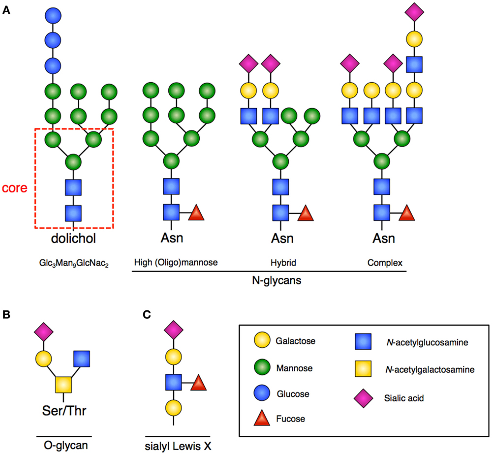
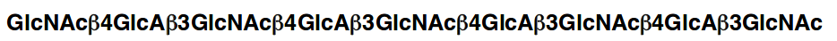

```{r setup, include=FALSE}
knitr::opts_chunk$set(echo = TRUE)
library(dplyr)
library(stringr)
library(purrr)
library(pls)
library(ggplot2)
library(knitr)
set.seed(1)
```

<br>
Very few methods for quantitative structure activity relationships (QSAR) involving glycans have been reported. I did some preliminary work to develop a practical method, which I will describe here. The first thing we need is a way to represent glycans that makes sense both to a chemist and to a computer. Glycans are typically described by a symbol nomenclature, as shown below:

```{r, echo = FALSE, out.width = "400px"}

```

<br>
And they are also described with text: 

```{r, echo = FALSE, out.width = "600px"}

```

I think representing the sugars as a directed acyclic graph like in the symbol nomenclature could be a great strategy, but it would take a lot of work. Using text representations of the glycans allows one to simply represent glycans in a meaningful way, and also to easily calculate statistics and features of the glycans using regular expressions. I will show how this is done using a simple, model system. I only use the 9 monosaccharides shown below:

```{r, echo = FALSE, out.width = "800px"}
sugar_dictionary <- data.frame(stereochemistry = rep(c("Glucose", "Galactose", "Mannose"), 3),
                               color = rep(c("Blue", "Yellow", "Green"), 3),
                               color_symbol = rep(c("B", "Y", "G"), 3),
                               sugar = rep(c("Hexose", "HexNAc", "Hexosamine"), each = 3),
                               shape = rep(c("Circle", "Square", "Crossed square"), each = 3),
                               shape_symbol = rep(c("C", "S", "X"), each = 3)
                               )
sugar_dictionary$symbol <- str_c(sugar_dictionary$color_symbol, sugar_dictionary$shape_symbol)
sugar_dictionary$name <- c("Glc", "Gal", "Man", "GlcNAc", "GalNAc", "ManNAc", "GlcN", "GalN", "ManN")
sugar_dictionary$code <- paste("-", sugar_dictionary$name, "-", sep = "")
kable(sugar_dictionary %>% select(name, sugar, stereochemistry))
```

For this example, I only use linear glycans, and assume that all linkages are uniform. I only focus on use single glycans, and no mixtures. 
<br>
Here, the glycan, Man<sub>3</sub>GlcNAc<sub>2</sub> is represented like this: "-Man-Man-Man-GlcNAc-GlcNAc-"
<br>
I populated the QSAR model with 150 random glycans: 50 4-mers and 100 6-mers. The first 5 look like this:


```{r, echo = FALSE, out.width = "800px"}
simulated_glycans <- as.character(rep(NA, 100))
for(i in 1:50){
  simulated_glycans[i] <-str_c(sample(sugar_dictionary$name, 4), collapse = "-")
}
for(i in 51:150){
  simulated_glycans[i] <-str_c(sample(sugar_dictionary$name, 6), collapse = "-")
}
simulated_glycans <- paste("-", simulated_glycans, "-", sep = "")
print(simulated_glycans[1:5])
simulated_glycans <- tibble(glycan = simulated_glycans)

```

<br>
I calculated statistics for these glycans, such as polymer length, the number of glucoses, the number of galactoses, etc. 
<br>
Here is what this looks like for the first 3 glycans:
<br>

```{r, echo = FALSE, out.width = "800px"}

# the length
simulated_glycans$length <- map_int(simulated_glycans$glycan, function(x) sum(str_count(x, sugar_dictionary$code)))

# number of Glucose, Galactose, Mannose stereochemistries
simulated_glycans$n_glucose <- map_int(simulated_glycans$glycan, function(x) sum(str_count(x, 
  sugar_dictionary$code[sugar_dictionary$stereochemistry == "Glucose"])))
simulated_glycans$n_galactose <- map_int(simulated_glycans$glycan, function(x) sum(str_count(x, 
  sugar_dictionary$code[sugar_dictionary$stereochemistry == "Galactose"])))
simulated_glycans$n_mannose <- map_int(simulated_glycans$glycan, function(x) sum(str_count(x, 
  sugar_dictionary$code[sugar_dictionary$stereochemistry == "Mannose"])))

# and also the sugars
simulated_glycans$n_hexose <- map_int(simulated_glycans$glycan, function(x) sum(str_count(x, 
  sugar_dictionary$code[sugar_dictionary$sugar == "Hexose"])))
simulated_glycans$n_HexNAc <- map_int(simulated_glycans$glycan, function(x) sum(str_count(x, 
  sugar_dictionary$code[sugar_dictionary$sugar == "HexNAc"])))
simulated_glycans$n_Hexosamine <- map_int(simulated_glycans$glycan, function(x) sum(str_count(x, 
  sugar_dictionary$code[sugar_dictionary$sugar == "Hexosamine"])))

out <- simulated_glycans[1:3, ]
names(out) <- c("glycan", "length", "glucose", "galactose", "mannose", "hexose", "HexNAc", "Hexosamine")
kable(out)
```

<br>
The number of times each monosaccharide occurs in the glycan sequence is shown below.
<br>

```{r, echo = FALSE, out.width = "800px"}
for(i in 1:length(sugar_dictionary$code)){
  monomer_name <- sugar_dictionary$code[i]
  monomer_name2 <- sugar_dictionary$name[i]
  monomer_count <- map_int(simulated_glycans$glycan, function(x) sum(str_count(x, monomer_name)))
  simulated_glycans <- cbind(simulated_glycans, monomer_count)
  names(simulated_glycans)[ncol(simulated_glycans)] <- paste("n_", monomer_name2, sep = "")
  names(simulated_glycans)
}
out <- simulated_glycans[1:3,c(1, 9:ncol(simulated_glycans))]
names(out) <- c("glycan", "Glc", "Gal", "Man", "GlcNAc", "GalNAc", "ManNAc", "GlcN", "GalN", "ManN")
kable(out)

```

<br>
The counts are also expressed as a percentage of the glycan length:
<br>

```{r, echo = FALSE, out.width = "700px"}
get_glycan_percentage <- function(x, divisor = simulated_glycans$length){
  y <- x/divisor
  return(y)
}
simulated_glycans_temp <- simulated_glycans %>% select(-glycan) %>% mutate_each(funs(get_glycan_percentage)) %>% select(-length)
names(simulated_glycans_temp) <- str_c(names(simulated_glycans_temp), "_fraction")
simulated_glycans <- cbind(simulated_glycans, simulated_glycans_temp)
out <- simulated_glycans[1:3,c(1, 2, 18:23)]
names(out) <- c("glycan", "length", "fraction glucose", "fraction galactose", "fraction mannose", "fraction hexose", "fraction HexNAc", "fraction hexosamine")
kable(out)
```

<br>
We can also count the number of times each two-mer, such as GlcNAc-Man or ManN-GlcN, appears in each glycan.

```{r, echo = FALSE, out.width = "700px"}
twomers <- data.frame(first = rep(sugar_dictionary$name, length(sugar_dictionary$name)), 
                      second = rep(sugar_dictionary$name, each = length(sugar_dictionary$name))
                      )
twomers$two_mers <- str_c(twomers$first, twomers$second, sep = "-")
twomers$two_mers <- paste("-", twomers$two_mers, "-", sep = "")
for(i in 1:length(twomers$two_mers)){
  twomer_name <- twomers$two_mers[i]
  twomer_count <- map_int(simulated_glycans$glycan, function(x) sum(str_count(x, twomer_name)))
  simulated_glycans <- cbind(simulated_glycans, twomer_count)
  names(simulated_glycans)[ncol(simulated_glycans)] <- paste("n_", twomer_name, sep = "")
  names(simulated_glycans)
}
out <- simulated_glycans[1:3, c(1, 77:82)]
names(out) <- c("glycan", "ManN-GalNAc", "Glc-ManNAc", "Gal-ManNAc", "Man-ManNAc", "GlcNAc-ManNAc", "GalNAc-ManNAc")
kable(out)

```

<br>
At this point, we already have 149 descriptors for each glycan, so I will stop there. To build a QSAR model, I simulated bioactivity data, and added a positive correlation with the number of sugars with mannose stereochemistry and also the number of ManN monomers. Here is the bioactivity data compared with the fraction of mannose:


```{r, out.width = "600px", echo = FALSE}
# let's build a simple model using only a few of these features
model_data <- simulated_glycans[, c(1, 2, 18:32)]
model_data$length <- model_data$length/max(model_data$length)

# and simulate some data, where the bioactivity is normally distributed around 10 and has 
# an engineered positive relationship with the fraction of mannose and the fraction of "ManN"
model_data$bioactivity <- rnorm(150, mean = 10, sd = 1)
model_data$bioactivity <- model_data$bioactivity + (model_data$n_mannose_fraction * 5) + 
  (model_data$n_ManN_fraction * 5)

model_data %>% ggplot(aes(x = n_mannose_fraction, y = bioactivity)) + geom_point(color = "blue") + ylab("Bioactivity") + xlab("Mannose Fraction") 
```

<br>
I fit a regression model against a subset of the glycan features. The features are highly correlated, so I used a partial least squares model. The diagnostic plot of the model reveals that most of the variance is explained by the first component. 

```{r, out.width = "600px", echo = FALSE}
#make the model, pls
pls_model <- plsr(bioactivity ~ ., ncomp = 5, data = model_data %>% select(-glycan), validation = "CV")

pls_cv <- RMSEP(pls_model)[[1]]
pls_plot <- data.frame(CV = pls_cv[1,1,1:6], components = 0:5)
pls_plot %>% ggplot(aes(x = components, y = CV)) + ggtitle("PLS Diagnostics") +
  xlab("Number of Components") + ylab("RMSEP") + geom_line(color = "blue") + geom_point(color = "blue")
```

<br>
To see what features are important for the model, we can look at the regression coefficients for the first component:


```{r, out.width = "600px", echo = FALSE}
# most of variance is explained by first component, let's check the coefficients 
second_comp <- data.frame(variable = names(pls_model$coefficients[, 1, 2]), 
                          `first component` = pls_model$coefficients[, 1, 1]
                          )
second_comp$variable <- c("length", "glucose fraction", "galactose fraction", "mannose fraction", "hexose fraction", "HexNAc fraction",
                          "hexosamine fraction", "Glc fraction", "Gal fraction", "Man fraction", "GlcNAc fraction", "GalNAc fraction", 
                          "ManNAc fraction", "GlcN fraction", "GalN fraction", "ManN fraction")
second_comp %>% ggplot(aes(x = variable, y = first.component, group = 1), fill = "blue") + 
  ggtitle("Loadings; First Component") + geom_line(color = "blue") + geom_point(color = "blue") +
  theme(axis.text.x = element_text(angle = 90, hjust = 1)) + ylab("Regression coefficients") + xlab("Feature")

```

<br>
The loadings are highest for the fraction of mannose and the fraction of ManN, telling us that these are most important for increasing bioactivity, just as they should be. This method can be extended to cover branched glycans, variable linkages, and glycan mixtures, and it could serve as the foundation for more robust methods to assist glycan medicinal chemistry. 
<br>
